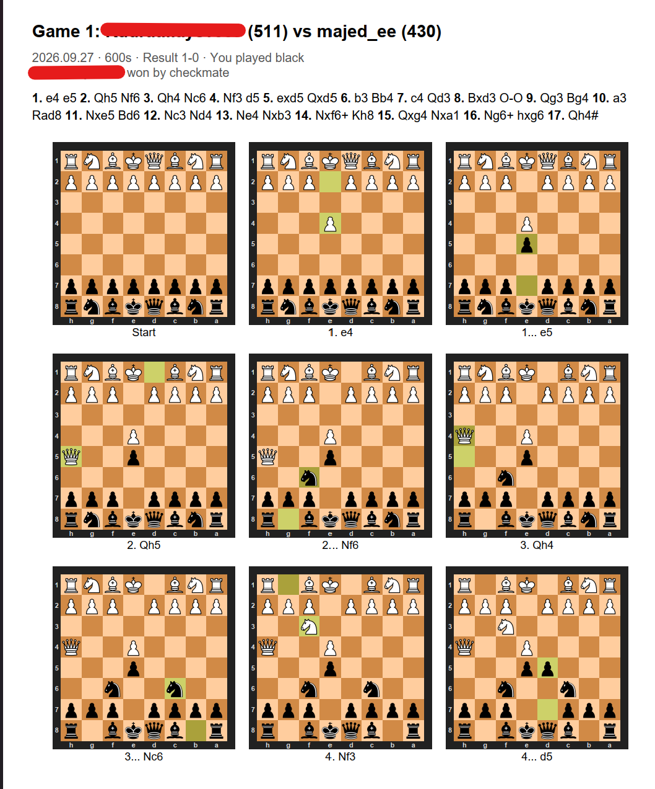
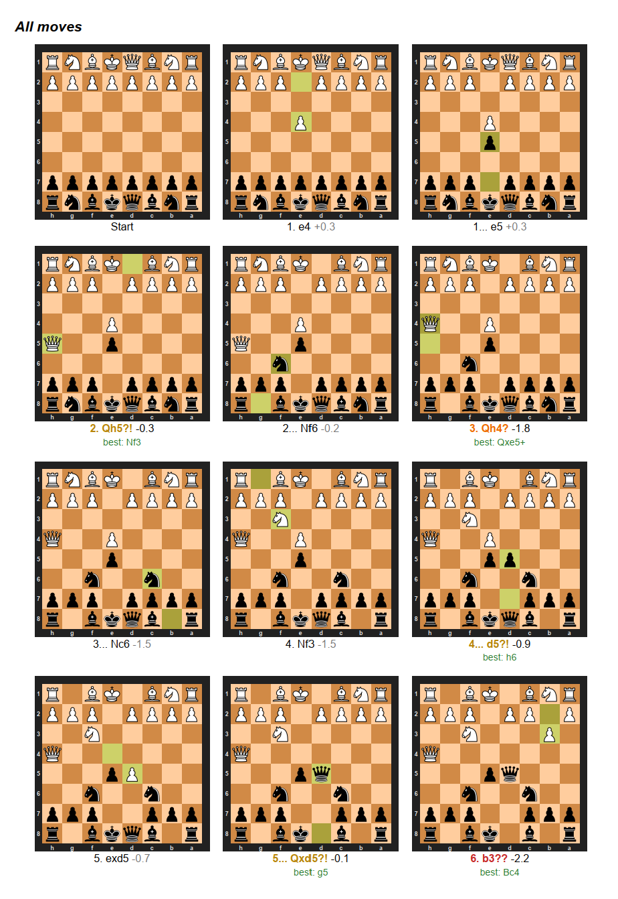
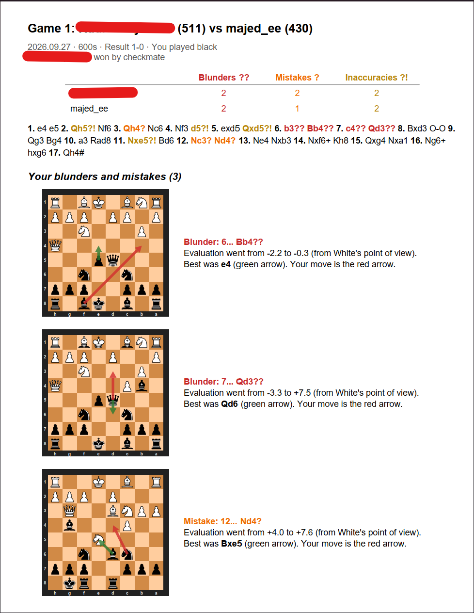

# Stupid Chess & Chess Analysis

Free, offline tools that turn a PGN file (e.g. a chess.com export) into printable PDFs with board images.

| Script                                          | What it makes                                                                                                                                        |
| ----------------------------------------------- | ---------------------------------------------------------------------------------------------------------------------------------------------------- |
| `stupidChess_PGN2PDF.py` ("stupid chess")       | **PGN → PDF**: every game with its move list and a board diagram after every move                                                                    |
| `stupidstupidChess_analysis_PGN2PDF_PGN2PDF.py` | **PGN → analysis PDF**: Stockfish review of every move, with blunders, mistakes and inaccuracies marked, plus arrows for your move and the best move |

No accounts and no paid services. Everything runs on your own machine.


Sample outputs in this repo:

- `games/game_001/game_001.pdf`: game PDF with every move
- `games/game_001/game_001_analysis.pdf`: analysis PDF

## Setup

```bash
pip install python-chess cairosvg reportlab pypdf
```

For the analysis you also need [Stockfish](https://stockfishchess.org/) (free), for example `winget install Stockfish.Stockfish`.

## Usage

```bash
# PGN -> PDF with board images
python stupidChess_PGN2PDF.py <pgn-name>

# PGN -> Stockfish analysis PDF with board images
python stupidChess_analysis_PGN2PDF.py <pgn-name>
```

Common options:

- `-o DIR`: output folder (default `games`)
- `-p NAME`: your username, used to orient the boards (default: the player who appears most often in the PGN)
- `-e PATH`: path to Stockfish (analysis only; default: `stockfish` on PATH, then the winget install location)
- `-t SECONDS`: engine time per position (analysis only; default `0.2`)

## Output

```
games/
├── game_001/
│   ├── position.png           # final position
│   ├── game_001.pdf           # all moves with boards
│   └── game_001_analysis.pdf  # engine analysis
├── ...
├── <pgn-name>_all_moves.pdf   # all games combined
└── <pgn-name>_analysis.pdf    # all analyses combined
```

Moves are classified the way Lichess does it, by how much the player's winning chances drop: **Blunder ??** at 15 percentage points or more, **Mistake ?** at 10 or more, and **Inaccuracy ?!** at 5 or more.


## Example Game Output

sample output of `games/game_001`, generated by `stupidChess_PGN2PDF.py`:



## Example Game Analysis

sample output of `games/game_001`, generated by `stupidstupidChess_analysis_PGN2PDF.py`:



## Example Blunder Analysis

sample output of `games/game_001`, generated by `stupidstupidChess_analysis_PGN2PDF.py`:



